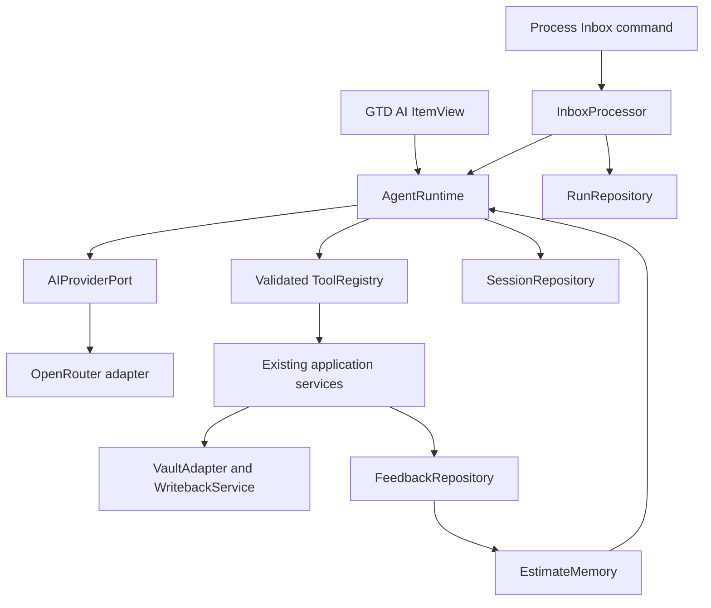
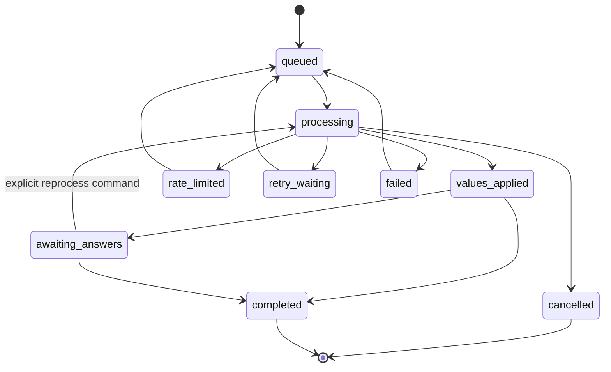

# GTD Flow AI Inbox and Estimates Plan

## Document status

- Status: implementation complete; live desktop release validation pending
- Feature branch: `codex/ai-inbox-agent`
- Baseline commit: `80ecc06` (`chore: resolve technical debt audit`)
- Last updated: 2026-07-29
- Change type: breaking

This document defines the plan for turning GTD Flow into a desktop-only,
AI-assisted task system with an embedded chat, command-driven inbox processing,
personalized estimates, user-configurable scopes, and a synced learning history.

## Implementation tracking

This is a live implementation record, not a release-complete claim.

| Area                             | Status                                 | Evidence / boundary                                                                                                                                                                                                                                                                                        |
| -------------------------------- | -------------------------------------- | ---------------------------------------------------------------------------------------------------------------------------------------------------------------------------------------------------------------------------------------------------------------------------------------------------------- |
| Markdown estimates and scope     | Implemented                            | `⏱`, `🧠`, `💓`, `💪`, and `🧭` parse and serialize as typed task fields; task, MCP and widget projections expose them.                                                                                                                                                                                    |
| Unified inbox and scope catalog  | Implemented                            | One `inboxFile` setting, synced scope catalog, and global discovery replace runtime namespace routing.                                                                                                                                                                                                     |
| Namespace migration              | Implemented                            | Compatibility reader plus explicit dry-run, journaled apply, resume and rollback commands. D1/D2 are chosen per migration UI.                                                                                                                                                                              |
| Desktop AI foundation            | Implemented                            | GTD AI view, command-driven processing, durable sessions/runs/feedback, ownership locks, OpenRouter OAuth/PKCE and `openrouter/free`.                                                                                                                                                                      |
| Learning and ownership           | Implemented                            | Corrections become field-specific labels and locks, retrieval reuses local examples, stale locked questions are retired, conflicts stay fail-closed, and Settings supports bounded inspect/export/clear controls.                                                                                          |
| Credentials and privacy controls | Implemented with deliberate limitation | Account-policy and fail-closed ZDR choices exist; only memory-only credentials are available, so reconnect is required after restart.                                                                                                                                                                      |
| Automated verification           | Verified                               | `npm run verify` passes: lint, formatting, TypeScript, both Svelte checks, 2,365 unit/integration tests with coverage, five browser flows, production builds, packaged-plugin smoke, bundle budgets and release artifacts. `npm audit` reports zero vulnerabilities.                                       |
| Release hardening                | Partially complete                     | Automated accessibility/browser composition, packaged desktop checks and the four-path D1/D2 migration matrix pass. A fresh release bundle and checksums were verified. A human desktop smoke test, live OAuth/OpenRouter run and real-vault migration remain. `main.js` is at 97.8% of its bundle budget. |
| Product decisions                | Resolved                               | D3–D8 are decided in Section 23. D1/D2 remain explicit choices for each migration run rather than global defaults.                                                                                                                                                                                         |

### Verification snapshot

On 2026-07-29, the combined feature branch passed:

- `npm run verify`
- 128 test files and 2,365 unit/integration tests
- coverage of 90.38% statements, 84.43% branches, 95.72% functions, and
  93.10% lines
- five Playwright flows, including real inbox-processing composition, linked
  questions, user locks, explicit quota retry, undo, and destructive-action
  rejection
- production-service integration covering a `429` response, durable waiting,
  explicit retry, completion lineage, Markdown writeback, restart recovery,
  `openrouter/free`, and credential non-persistence
- production plugin, MCP, and widget builds, packaged-plugin smoke, artifact
  contract validation, and a fresh `v0.13.0` release-candidate bundle with verified
  checksums
- bundle budgets pass; `main.js` is 1,368,600 of 1,400,000 bytes (97.8%).
  Further feature growth should include bundle splitting or another deliberate
  budget review
- all four combinations of the explicit D1/D2 migration choices, covering
  non-mutating dry-run, journaled ID insertion, source/task/settings bindings,
  content compare-and-set, recoverable delete tombstones, interrupted
  apply/resume, idempotency, and exact rollback
- `npm audit --audit-level=low` with zero reported vulnerabilities

This snapshot does not replace the manual release checks named above.
Obsidian's public Vault API has no conditional-unlink primitive, so migration
rollback retains a minimal final authoritative-read-to-delete race. A
recoverable tombstone and two authoritative process/read barriers reduce this
window and preserve observed intervening edits; this platform limitation must
remain documented.

## 1. Goals

The MVP must:

1. Add total elapsed-time estimates to tasks.
2. Add separate cognitive, emotional, and physical intensity estimates.
3. Replace namespaces with exactly one user-configurable task scope.
4. Use one configurable Markdown inbox file.
5. Add an AI chat view inside Obsidian.
6. Process and reprocess inbox tasks through explicit commands.
7. Apply provisional AI values immediately and ask follow-up questions afterward.
8. Protect user-edited fields from later AI overwrites.
9. Learn from user corrections and make the learning history inspectable and synced.
10. Use OpenRouter OAuth and `openrouter/free`.
11. Keep credentials local to the device.
12. Preserve the existing validated task and vault write boundaries.

## 2. Confirmed product decisions

### 2.1 Duration

- Duration means total elapsed time, not active working time.
- Values below 24 hours use five-minute increments.
- Values from 24 hours upward must be exact whole-day multiples: `24h`, `48h`,
  and so on. Partial-day values such as `37h` are invalid rather than rounded.
- The minimum is five minutes; `0m` is invalid.
- There is no product-level maximum.
- AI may leave duration unknown.
- Ninety minutes displays as `1h 30m`.
- Whole-day values display as `1d`, `2d`, and so on.
- The canonical stored value is minutes, not a formatted string.

Logical domain type:

```ts
type DurationMinutes = number;

function isDurationMinutes(value: unknown): value is DurationMinutes {
  return (
    typeof value === "number" &&
    Number.isSafeInteger(value) &&
    value >= 5 &&
    (value < 1_440 ? value % 5 === 0 : value % 1_440 === 0)
  );
}
```

The task-level field is `DurationMinutes | null`.

### 2.2 Intensity

Every AI-processed task must receive all three dimensions:

```ts
interface TaskIntensity {
  cognitive: 0 | 1 | 2 | 3 | 4 | 5;
  emotional: 0 | 1 | 2 | 3 | 4 | 5;
  physical: 0 | 1 | 2 | 3 | 4 | 5;
}
```

- `0` means not applicable.
- `5` means the highest intensity.
- Physical intensity means literal bodily exertion.
- AI may not leave an intensity dimension unknown after successful processing.
- An entirely unprocessed legacy task may have no intensity fields yet.

The prompt and UI must include stable descriptions for all six levels. These
anchors are part of the estimator version and must not change without a prompt
version bump.

### 2.3 Scope

- Scope is a dedicated task field, not a tag.
- Scope definitions are user-configurable.
- A processed task has exactly one scope.
- Namespaces are removed from the product.
- Scope IDs are stable; display names may be renamed.
- AI must choose the best-fitting active scope from the current catalog.
- AI never creates a scope. Processing is blocked until the user configures at
  least one active scope.

### 2.4 Inbox and processing

- The MVP uses one configurable Markdown inbox file.
- Daily inbox files are a possible future storage strategy, not part of this MVP.
- Initial processing and reprocessing are initiated only through commands.
- Confident and provisional values are written immediately.
- Missing information does not block the initial write.
- Questions are asked after provisional values have been applied.
- Each processing run creates a new conversation.
- A user-edited field becomes locked against later AI overwrites.
- Unlocking and reprocessing a field must be explicit.
- Spawned recurring instances inherit the template's current
  duration/intensity/scope fields, including AI-generated values. They do not
  inherit prediction provenance as fresh confirmed feedback.

### 2.5 Embedded agent

- The plugin contains a separate AI chat view.
- Chat may search and read the entire vault.
- Relevant context is retrieved locally and selected excerpts are sent to the
  model. The whole vault is not sent on every request.
- Chat may use all existing GTD Flow task, project, board, and vault operations
  through validated tools.
- Read-only actions are automatic.
- Reversible single-task edits are automatic and expose undo.
- Deletions and bulk mutations require a preview and confirmation.

### 2.6 Provider and platform

- The AI MVP is desktop-only.
- Authentication uses OpenRouter OAuth with PKCE/S256.
- The model route is `openrouter/free`.
- The actual model selected by OpenRouter is recorded for every response.
- No paid-model fallback is allowed.
- When free capacity is exhausted, work remains queued.
- Provider routing follows the user's OpenRouter account policy by default.
  Strict ZDR remains an optional fail-closed override.
- Credentials remain local and never enter the vault, synced settings, logs,
  prompts, exports, or diagnostic bundles.
- The current desktop implementation offers only memory-only credentials; a user
  reconnects after every Obsidian restart. This is the accepted MVP behavior,
  not a release blocker.

### 2.7 Synced state

GTD Flow owns a hidden vault folder:

```text
.gtd-flow/
```

Chat sessions, processing runs, scope definitions, questions, feedback, prepared
feedback records and migration journals are synced through that folder.
Credentials and rebuildable local indexes are not.

## 3. Explicitly out of scope for the MVP

- Voice capture and speech-to-text
- Turning an arbitrary brain dump into multiple tasks
- AI-generated deadlines
- AI-generated priority
- Mobile AI support
- Paid-model fallback
- Scheduled or event-triggered processing
- Automatic reprocessing after every Markdown edit
- Daily inbox files
- Hosted vector database
- Fine-tuning
- Sending the entire vault in each prompt
- Direct model access to the filesystem or shell

The general chat may manipulate existing GTD Flow data through tools, but the
specialized inbox processor only owns duration, intensity, scope, and questions.

## 4. Proposed task representation

### 4.1 Current values in Markdown

Current effective task values belong in the Markdown task line. Logical fields:

```text
duration
cognitive intensity
emotional intensity
physical intensity
scope ID
```

The canonical task-field glyphs are:

```md
- [ ] Reconcile invoices ⏱ 90m 🧠 4 💓 2 💪 0 🧭 work
```

Requirements:

- Fields are recognized by the tokenizer and excluded from `Task.description`.
- Existing tasks parse with all new values absent.
- No bulk migration is needed merely to introduce the fields.
- Valid duration payloads are five-minute multiples below 24 hours and
  whole-day multiples from 24 hours upward.
- Intensity payloads are integers from zero through five.
- Scope payloads are stable scope IDs.
- Duplicate fields follow the existing last-effective-value rule.
- Dedicated serializers validate values before writing.
- Clearing a field removes all duplicates.
- Invalid or unknown syntax remains losslessly preserved.
- Structural estimate/scope writes ensure a stable task ID.

### 4.2 Provenance outside Markdown

Task lines contain current values, not model names, predictions, confidence,
locks, prompts, or correction history. Those belong in `.gtd-flow/`.

This keeps task Markdown readable while preserving enough history to answer:

- What did AI predict?
- Which model and prompt version produced it?
- What did the user change?
- Which fields are AI-owned or user-locked?
- Which examples informed a later prediction?

## 5. Hidden-folder layout

Proposed canonical layout:

```text
.gtd-flow/
  config/
    scopes.json
    ai-policy.json
  ai/
    sessions/
      <session-id>/
        header.json
        messages/
          <message-id>.json
    runs/
      <run-id>.json
    recovery-leases/
      <run-id>/
        <lease-id>.json
    feedback/
      <event-id>.json
    feedback-outbox/
      <event-id>.json
    migrations/
      <migration-id>.json
```

Local-only, rebuildable state must live outside the synced vault folder:

```text
credential
OAuth verifier and transient state
full-text or vector index cache
network retry timers
redacted diagnostic cache
```

Canonical synced records use:

- `schemaVersion`
- random immutable IDs
- ISO timestamps
- task IDs rather than line numbers
- explicit model, provider, prompt, tool, and retrieval versions
- no credential material

Immutable feedback, session-message, and recovery-lease files avoid shared-file
append conflicts. Legacy `<session-id>.jsonl` sessions remain readable during
upgrade. Session assembly deduplicates immutable message IDs and tolerates
out-of-order sync delivery.

Obsidian vault APIs provide local create-if-absent, not a globally linearizable
cross-device compare-and-swap. Recovery therefore fails closed whenever it can
observe competing or invalid leases. Fully offline devices cannot receive a
distributed exactly-once guarantee until their sync provider delivers those
immutable lease records; this limitation must remain visible in release notes.

## 6. Scope model

Proposed scope catalog:

```ts
interface ScopeCatalogV1 {
  schemaVersion: 1;
  scopes: Array<{
    id: string;
    name: string;
    order: number;
    archived: boolean;
  }>;
}
```

Rules:

- `id` is immutable and safe for task-line serialization.
- `name` is user-facing and may change without rewriting every task.
- An archived scope remains resolvable for existing tasks but is unavailable for
  new AI classifications.
- Deleting a referenced scope is not allowed until tasks are reassigned.
- Processing is disabled until at least one active scope exists.
- Scope selection in model output is validated against the exact active ID enum.
- Scope management is synced because the catalog is stored in `.gtd-flow/`.

## 7. Namespace removal and migration

Namespace removal is the highest-risk part of the change and must not be mixed
with the first parser implementation.

### 7.1 Target state

- One `inboxFile` setting replaces per-namespace capture targets.
- Namespace selectors disappear from all views.
- Query evaluation no longer receives namespace filters.
- `gtd-namespace` frontmatter is no longer interpreted.
- MCP tools replace `namespace` inputs/outputs with `scope`.
- Projects, boards, calendars, recurring tasks, and archives are discovered
  globally under their existing frontmatter contracts.
- Scope filtering is explicit task filtering, not path-based membership.

### 7.2 Migration workflow

The migration must:

1. Discover existing namespace definitions and affected files.
2. Build a dry-run inventory.
3. Ask the user to map old namespaces and Common to scopes.
4. Show every planned task annotation and inbox move.
5. Create a durable migration journal before the first mutation.
6. Ensure stable task IDs inside that journaled operation, and only for tasks
   selected by the approved dry-run.
7. Apply scope fields according to the approved migration policy.
8. Move active inbox lines into the unified inbox without losing child blocks.
9. Preserve source files; do not delete them automatically.
10. Update settings only after task migration succeeds.
11. Support restart/resume and explicit rollback.
12. Leave an inspectable migration result in `.gtd-flow/ai/migrations/`.

Migration and namespace deletion must be separate commits so the compatibility
reader can be tested before old behavior is removed.

## 8. Agent architecture



### 8.1 Shared runtime

Chat and inbox processing share:

- provider abstraction
- message representation
- streaming event protocol
- cancellation
- tool schema and validation
- approval handling
- session persistence
- context retrieval
- redaction
- retry classification

They do not share unrestricted prompts or permissions:

- Chat uses the broad tool registry and risk-tier approvals.
- Inbox processing uses a constrained structured-output workflow and may mutate
  only duration, intensity, scope, and question state.

### 8.2 Suggested modules

```text
src/ai/
  core/
    AgentRuntime.ts
    events.ts
    messages.ts
    errors.ts
  providers/
    AIProviderPort.ts
    OpenRouterProvider.ts
    openRouterSchemas.ts
    sseParser.ts
  auth/
    OpenRouterOAuth.ts
    CredentialStorePort.ts
    DesktopCredentialStore.ts
  tools/
    ToolRegistry.ts
    permissionPolicy.ts
    taskTools.ts
    vaultTools.ts
  sessions/
    SessionRepository.ts
    sessionSchemas.ts
  processing/
    InboxProcessor.ts
    ProcessingQueue.ts
    processingSchemas.ts
  feedback/
    FeedbackRepository.ts
    estimateMemory.ts
    taskFeatures.ts
  storage/
    GtdFlowFolder.ts
    atomicJson.ts
```

The exact file split may change during implementation, but provider, tools,
storage, UI, and domain logic must remain independently testable.

## 9. OpenRouter integration

### 9.1 OAuth

- Use PKCE with S256.
- Generate cryptographically random `state` and `code_verifier`.
- Bind a temporary loopback callback on an arbitrary available port.
- Validate `state` before exchanging the code.
- Close the callback server after success, cancellation, or timeout.
- Exchange the authorization code for a user-controlled API key.
- Store the resulting key only through `CredentialStorePort`.
- Provide disconnect/revoke and reconnect actions.
- Never fall back to vault or `data.json` plaintext storage.

The first implementation step is a feasibility spike for OS-backed secret
storage from the Obsidian Electron runtime. If a safe persistent adapter is not
available, fail closed and keep the key in memory for the session rather than
silently persisting plaintext.

### 9.2 Model routing

- Send `model: "openrouter/free"`.
- Request required capabilities explicitly.
- Record the actual returned model ID on every assistant response and run.
- Do not silently retry on a paid model.
- Treat model changes between requests as expected.
- Keep prompts provider-neutral.
- Validate all tool calls and structured results locally.

### 9.3 Interactive chat

- Use SSE streaming.
- Ignore SSE comment/keepalive frames.
- Handle pre-stream HTTP errors and mid-stream error events.
- Support cancellation with `AbortController`.
- Persist streamed output only after framing and schema validation.
- Show the actual model, current state, and retryability in the UI.

### 9.4 Structured inbox processing

- Prefer non-streaming strict JSON Schema output.
- Require all supported schema parameters from the selected endpoint.
- Reject invalid task IDs, scopes, duration increments, and intensity values.
- Allow one schema-repair attempt without executing mutations.
- If repair fails, mark the run failed and preserve the inbox unchanged.

### 9.5 Retries and rate limits

- Use one queue worker.
- Coalesce tasks into bounded batches.
- Honor `Retry-After`.
- Apply exponential backoff with jitter for retryable failures.
- Persist `rate_limited` only for actual rate-limit responses such as HTTP 429.
- Persist other retryable provider failures as `retry_waiting`; never present
  them as exhausted free quota.
- Persist the next eligible retry time for both waiting states.
- Do not retry continuously while Obsidian is closed.
- Resume only when the plugin is open and the user invokes processing/retry.
- Distinguish work waiting for free capacity from work waiting after another
  temporary provider failure.

## 10. Inbox-processing workflow

### 10.1 Commands

Initial command set:

```text
GTD Flow: Process inbox with AI
GTD Flow: Cancel active AI inbox processing
GTD Flow: Reprocess selected task with AI
GTD Flow: Open AI conversation for last run
GTD Flow: Unlock selected AI field
```

No automatic file-change listener initiates a model request.

### 10.2 Run lifecycle



Each run:

1. Creates a new session and run ID.
2. Snapshots eligible inbox tasks.
3. Ensures stable task IDs before sending context.
4. Retrieves relevant local feedback examples.
5. Sends a bounded batch to OpenRouter.
6. Validates the complete response locally.
7. Applies each task's AI-owned fields atomically.
8. Records the prediction before exposing it as learned evidence.
9. Opens the run conversation when questions exist.
10. Shows a summary of applied, skipped, locked, failed, and waiting tasks.

### 10.3 Structured result

Conceptual response:

```ts
interface InboxProcessingResult {
  tasks: Array<{
    taskId: string;
    durationMinutes: number | null;
    intensity: {
      cognitive: 0 | 1 | 2 | 3 | 4 | 5;
      emotional: 0 | 1 | 2 | 3 | 4 | 5;
      physical: 0 | 1 | 2 | 3 | 4 | 5;
    };
    scopeId: string;
    confidence: {
      duration: number;
      cognitive: number;
      emotional: number;
      physical: number;
      scope: number;
    };
    questions: Array<{
      id: string;
      text: string;
      affectedFields: Array<"duration" | "cognitive" | "emotional" | "physical" | "scope">;
    }>;
  }>;
}
```

Questions do not postpone the first write. Answering persists bounded context
without contacting the provider. The next explicit reprocess command consumes
that context only for the linked task and fields that remain AI-owned.

## 11. Field ownership, locking, and feedback

### 11.1 Ownership states

Each field independently has:

```ts
type FieldOwner = "ai" | "user";

interface FieldProvenance {
  owner: FieldOwner;
  locked: boolean;
  lastPredictionEventId: string | null;
  updatedAt: string;
}
```

Rules:

- Initial AI output creates `owner: "ai", locked: false`.
- AI may update an AI-owned, unlocked field during explicit reprocessing.
- Editing a field through GTD Flow UI creates `owner: "user", locked: true`.
- Clearing a field manually is a locked user decision, not permission for AI to
  refill it.
- A raw Markdown field change not attributable to the current agent mutation is
  treated as user-owned and locked.
- A synced change whose origin cannot be proven is treated as user-owned. False
  locking is safer than overwriting.
- Unlocking is explicit and logged.
- Title edits alone do not unlock estimate fields.

### 11.2 Feedback events

Suggested event kinds:

```text
estimate-suggested
estimate-corrected
estimate-manual
field-unlocked
question-asked
question-answered
scope-changed
```

Every prediction records:

- task ID and task snapshot
- duration/intensity/scope output
- confidence per field
- actual OpenRouter model ID
- prompt and schema versions
- retrieved example IDs
- run and session IDs

Only explicit user values and corrections are labels. A suggestion that the user
never reviews is not treated as confirmed merely because the task is completed.

## 12. Chat view

Add a new registered Obsidian `ItemView`:

```text
GTD: AI
```

Required UI:

- session list
- new-chat action
- message composer
- streamed assistant output
- stop/cancel action
- tool activity timeline
- approval cards
- pending inbox questions
- task links
- actual model name
- queued/rate-limited/retry-waiting/offline state
- reconnect/disconnect status
- local error details without prompt or credential leakage

Chat history is stored in `.gtd-flow/ai/sessions/`. Each inbox-processing run
creates a separate session; ordinary chats create independent sessions.

## 13. Tool registry and permissions

The model never receives raw filesystem, shell, or Obsidian internals. It can
request narrow, validated application tools.

Initial tool groups:

### Read without confirmation

- search vault
- read a note or bounded excerpt
- list/find/get tasks
- list projects and boards
- inspect task relationships
- inspect scope catalog
- inspect current AI run

### Reversible single-item writes with undo

- create task
- edit task description
- set or clear supported task fields
- move one task
- connect/disconnect one dependency
- update one project or board item through existing services

### Preview and confirmation required

- delete task
- delete file
- bulk mutation
- bulk move
- scope migration
- namespace migration
- destructive project/board operation

Permissions are enforced by code after model output. Prompt instructions are not
a security boundary.

## 14. Learning and retrieval

### 14.1 MVP memory

Do not start with a vector database.

Use:

- corrected and manually supplied examples
- normalized task wording
- word and character n-grams
- scope match
- tags
- project/heading/container context
- recurrence context
- recency

Retrieve a small bounded set of examples. Duration and each intensity dimension
are ranked independently because their nearest examples may differ.

### 14.2 Canonical versus derived data

- Feedback event files are canonical and synced.
- Chat sessions are canonical and synced.
- Task Markdown is canonical for current effective values.
- Full-text indexes, embeddings, and ANN structures are derived and rebuildable.

### 14.3 Vector-search gate

Evaluate embeddings only after a useful labeled corpus exists. Use a
chronological holdout and compare against the lexical/structured baseline.

Embeddings may be added only if they materially improve:

- duration exact-match rate or absolute error
- intensity ordinal error
- scope accuracy
- correction rate

A flat local embedding cache should precede a full vector database. A hosted
vector database is not part of the current plan.

## 15. Settings and desktop boundary

Settings changes:

- bump the persisted settings schema version
- replace namespace configuration with `inboxFile`
- add AI enabled/connected state
- add hidden-folder initialization state
- add prompt/schema version state where migration requires it
- add no credential or conversation content to `data.json`

Scope definitions live in `.gtd-flow/config/scopes.json`, not `data.json`.

Set:

```json
{
  "isDesktopOnly": true
}
```

Mobile should show a clear incompatibility through Obsidian's manifest behavior,
not fail at runtime after loading desktop-only modules.

## 16. UI changes outside chat

Task cards and project nodes show:

- formatted duration
- cognitive intensity
- emotional intensity
- physical intensity
- scope name
- AI/user ownership and lock state through text/tooltips, not color alone

Task menus add:

- edit duration
- edit each intensity
- change scope
- clear a field
- open related AI run

Unlocking and reprocessing remains command-only, using the cursor command's
explicit field picker.

Editing several fields in one modal should use one atomic task-line write.

The inbox view removes namespace selection and targets the configured unified
inbox file.

## 17. MCP and widget compatibility

MCP must expose the same canonical task fields:

```text
duration_minutes
cognitive_intensity
emotional_intensity
physical_intensity
scope
```

Namespace parameters and outputs are removed as a documented breaking change.

The application tool registry should reuse core services also used by MCP rather
than calling MCP from inside the plugin.

Widgets:

- parse and display the new fields
- allow manual edits where current widget permissions allow
- never perform OAuth or AI requests
- remain functional when AI state is unavailable

## 18. Security requirements

- OAuth uses PKCE/S256 and state validation.
- Credentials never enter the vault.
- No shared developer API key is bundled.
- Tool arguments are schema-validated.
- Tool paths are vault-contained.
- Vault text and tool output are treated as untrusted prompt content.
- Prompt injection cannot bypass the permission layer.
- Model-proposed deletions and bulk writes require confirmation.
- Logs contain IDs and error classes, not task titles, note content, prompts,
  answers, or keys.
- Context is bounded before network transmission.
- Free-model/provider failures never corrupt task Markdown.
- Partial batch success is explicit and restart-safe.
- Hidden-folder files use atomic writes.
- Migration journals are written before mutations.

## 19. Implementation sequence

### Phase 0 — decisions and technical spikes

- Record the resolved decisions in Section 23 and keep D1/D2 explicit in the
  migration wizard.
- Audit candidate task-field glyphs for collisions.
- Prototype OAuth loopback callback.
- Prove OS-backed credential storage or define the memory-only fallback.
- Confirm direct OpenRouter streaming from Obsidian Electron.
- Write architecture decision records for storage and namespace migration.

Exit criteria:

- no unresolved data-loss or credential-storage design
- mocked OAuth flow passes
- chosen field syntax round-trips losslessly

### Phase 1 — task fields

- Extend `Task`.
- Extend emoji/token field registry.
- Add parser, serializer, and task-key support.
- Add atomic estimate/scope intent.
- Add writeback ID injection.
- Extend recurrence, projections, MCP, and widgets.
- Add manual card/menu editing and formatting.

Exit criteria:

- existing notes need no migration
- parser/serializer property tests pass
- manual values work completely without AI

### Phase 2 — scopes and unified inbox

- Add scope catalog repository and UI.
- Add `inboxFile`.
- Remove namespace controls from capture and views.
- Add scope filtering and display.
- Update query/store contracts.
- Update MCP contracts.

Exit criteria:

- a new vault works with one inbox and no namespace configuration
- every processed task can resolve exactly one active scope

### Phase 3 — namespace migration

- Add compatibility reader.
- Implement dry-run inventory and mapping UI.
- Add journal, backup, resume, and rollback.
- Migrate tasks according to the approved policy.
- Move inbox lines to the unified inbox.
- Remove namespace settings and behavior after migration.

Exit criteria:

- representative old vault fixtures migrate without task loss
- rollback restores byte-equivalent source state
- interrupted migration resumes idempotently

### Phase 4 — AI provider and storage

- Add hidden-folder storage.
- Add provider-neutral runtime interfaces.
- Implement OpenRouter OAuth.
- Implement credential adapter.
- Implement `openrouter/free` requests.
- Add SSE streaming, cancellation, validation, and retry classification.

Exit criteria:

- key is absent from vault and plugin settings
- chat can stream a mocked and a manual live response
- selected actual model is recorded
- no paid fallback occurs

### Phase 5 — processing queue and questions

- Implement run repository and durable queue.
- Add strict inbox-processing schema.
- Add Process/Reprocess commands.
- Apply task results atomically.
- Create one conversation per run.
- Add provisional question flow.
- Add distinct rate-limit and generic retry-waiting states with manual resume.

Exit criteria:

- full command flow works across restart
- invalid output writes nothing
- valid tasks can succeed when a sibling task fails
- questions update only linked, unlocked fields

### Phase 6 — embedded chat and tools

- Register the AI view.
- Add session list and streaming composer.
- Add task/vault tool registry.
- Add tool progress and cancellation.
- Add risk-tier approval UI.
- Add undo for reversible writes.

Exit criteria:

- chat can search, read, create, and edit through validated services
- destructive/bulk operations cannot run without confirmation
- no raw filesystem or shell access exists

### Phase 7 — feedback and personalization

- Add provenance and field locks.
- Detect non-agent Markdown changes conservatively.
- Add feedback events.
- Add lexical/structured retrieval.
- Include bounded examples in estimation prompts.
- Add learning-history inspect/export/clear controls.

Exit criteria:

- user corrections affect later similar predictions
- AI never overwrites a locked field
- deleting a derived index loses no canonical history

### Phase 8 — release hardening

- Accessibility and keyboard review.
- Browser tests for chat, questions, approval, and field editing.
- Migration matrix.
- Bundle-size review.
- Security review.
- Documentation and upgrade guide.
- Mark release as breaking and desktop-only.

Exit criteria:

- `npm run verify` passes
- migration and rollback are documented
- no unresolved high-severity review findings

## 20. Test plan

### Unit and property tests

- duration validation and formatting
- all intensity values and invalid payloads
- scope ID serialization
- tokenizer lossless round-trip
- duplicate/removal semantics
- task-key stability
- intent resolution
- per-field locking
- prompt/schema versioning
- lexical retrieval determinism

### Service tests

- atomic estimate/scope write
- external mirror rejection
- recurrence behavior
- unified inbox capture
- migration dry-run/apply/resume/rollback
- durable queue recovery
- rate-limit versus generic retry-waiting classification
- OAuth state and PKCE validation
- credential-store failure
- SSE framing and mid-stream errors
- tool permission enforcement

### Browser tests

- open AI view
- stream and cancel chat
- show actual model
- process inbox batch
- provisional values appear before questions
- answer a linked question
- edit and lock one field
- reprocessing skips locked fields
- approve/reject a destructive tool call
- keyboard and screen-reader behavior

### Security tests

- malicious vault text cannot invoke tools directly
- path traversal is rejected
- malformed tool calls are rejected
- credentials never serialize
- logs redact content
- invalid model output writes nothing
- no paid fallback request is constructed

### Release gates

- lint
- formatting
- TypeScript
- Svelte compiler and semantic checks
- coverage thresholds
- browser tests
- production builds
- bundle budgets
- release-contract validation

## 21. Observability and failure UX

Each run exposes:

- run ID
- session ID
- state
- task counts by result
- actual model
- start/end time
- retryability
- next eligible retry time when supplied
- redacted error class

Never expose task content in console logs. User-visible session history may show
the content because it is the intended private product surface.

Failure rules:

- OAuth failure changes no task.
- Provider failure changes no task.
- Schema failure changes no task.
- Per-task write failure does not roll back successful sibling tasks, but the
  partial result is explicit.
- Feedback-write failure does not roll back the user's task edit; it creates a
  durable retry and warning.
- A missing scope catalog blocks processing with an actionable setup message.

## 22. Definition of done

The MVP is complete when a user can:

1. Install the desktop-only plugin.
2. Configure scopes and a unified inbox.
3. Connect OpenRouter through OAuth.
4. Capture ordinary Markdown tasks without AI.
5. Run Process Inbox.
6. Receive duration, three intensity values, and one scope per processed task.
7. See provisional values immediately.
8. Answer follow-up questions without starting a model request, then explicitly
   reprocess the task in a new run conversation.
9. Manually change any field and have it remain protected.
10. Explicitly unlock and reprocess a field.
11. Chat with the AI and let it use validated vault/task tools.
12. Review and confirm destructive or bulk changes.
13. Restart Obsidian without losing runs, questions, or chat history.
14. Wait safely when the free quota is exhausted.
15. Inspect/export/clear learning history.
16. Migrate from namespaces without losing or duplicating tasks.

All repository verification gates must pass.

## 23. Migration choices and resolved product decisions

D1 and D2 are intentionally selected in every migration wizard. They do not
have global defaults:

- **D1 — namespace coverage:** the user chooses either every task under each
  namespace root or only tasks from namespace inboxes.
- **D2 — former Common tasks:** the user chooses either to leave them unscoped
  or assign a selected configured scope.

The remaining decisions are resolved:

- **D3 — scope creation:** AI never creates scopes. It selects the best-fitting
  existing active scope and assumes the configured catalog contains a fit.
- **D4 — canonical glyphs:** duration `⏱`, cognitive intensity `🧠`, emotional
  intensity `💓`, physical intensity `💪`, and scope `🧭`.
- **D5 — recurrence:** spawned instances inherit the template's current
  duration, all three intensities, and scope, including AI-generated values.
  Prediction provenance is not copied as a fresh label.
- **D6 — OpenRouter privacy:** requests follow the user's OpenRouter account
  provider policy by default. An optional strict ZDR override remains
  fail-closed and is never relaxed silently.
- **D7 — duration boundary:** `5m` is the minimum and `0m` is invalid. Below
  `24h`, values use five-minute increments. From `24h` upward, only whole-day
  multiples are accepted and displayed as `1d`, `2d`, and so on; values such as
  `37h` are rejected rather than rounded.
- **D8 — credentials:** memory-only OAuth credentials with reconnect after an
  Obsidian restart are accepted for the MVP. Plaintext vault or `data.json`
  storage remains prohibited.

## 24. Recommended commit boundaries

Keep the branch reviewable with narrow commits:

1. `docs: add AI inbox implementation plan`
2. `feat(tasks): add estimate and scope fields`
3. `feat(scopes)!: replace namespaces with scopes`
4. `feat(migration): migrate namespaces to scopes`
5. `feat(ai): add OpenRouter OAuth provider`
6. `feat(ai): add durable inbox processing`
7. `feat(ai): add embedded chat and tools`
8. `feat(ai): learn from user corrections`
9. `docs: document breaking AI inbox release`

Do not combine migration, OAuth, chat UI, and task parser changes in one commit.
